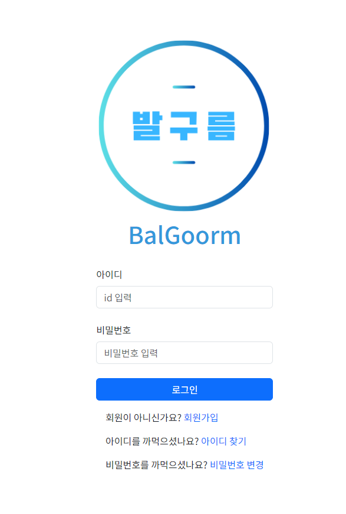
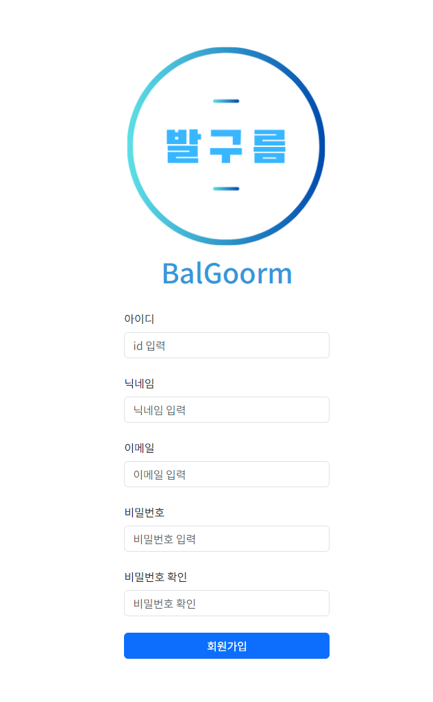
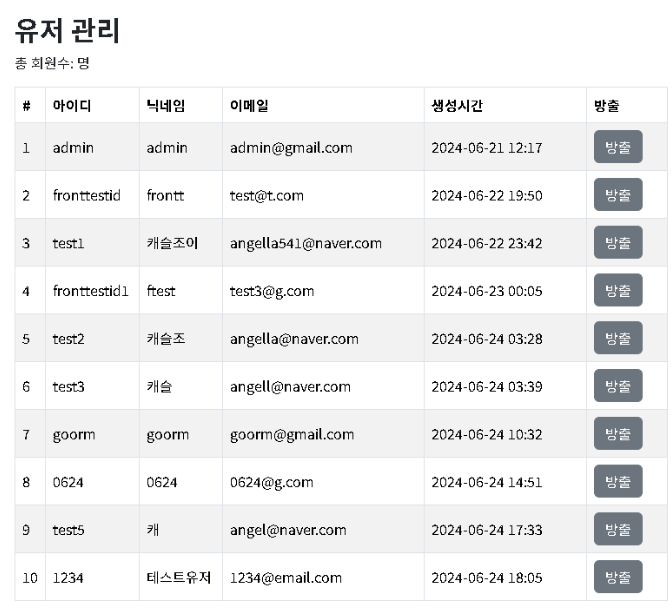
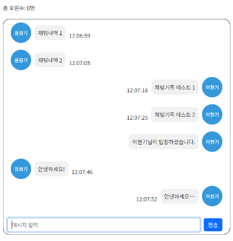

# BalgoormIDE
구름(goorm) 풀스택 개발자 성장 과정 7회차 발구름 조의 Web IDE 제작 프로젝트입니다.

 

개발자가 되고 싶어하는 사람들이 처음 코딩을 시작할 때 코딩에 흥미를 줄 수 있도록

퀴즈 형식으로 문제를 풀어 코딩 능력을 향상시키기 위해 제작한 사이트 입니다.

 

## 사용법
<h4>배포 주소: https://k33d397de87b1a.user-app.krampoline.com/ </h4>

 

### 로컬에서 실행할 때
1. Github에 올라온 코드를 다운 받는다.
2. 명령 프롬포트나 쉘에서 `npm install`를 입력한다.
3. 다운이 다 되었으면 `npm run start`로 앱을 실행한다.

 

## 프로젝트 개요

프로젝트 이름: 발구름IDE

개발기간: 2023.05 ~ 2023.06

 

사용 기술스택

 

   
   
   
  
  
   

   
   
  

  
  
   

 

## 나의 역할

저는 로그인, 회원가입, 마이페이지, 관리자 페이지를 작성하였고, 채팅 페이지를 개발했습니다.

- Axios 라이브러리로 회원가입, 로그인, 정보 가져오기 등 다양한 api 처리를 했습니다.

---
로그인 페이지는 이렇게 구성했습니다.

---
회원가입 페이지 입니다.

react-hook-form 라이브러리로 회원가입 시 이메일 형식, 비밀번호를 제대로 입력했는지(비밀번호 확인) 검증을 하였습니다.

---
관리자 페이지 입니다.

회원가입한 사용자들의 아이디, 닉네임, 이메일, 생성시간 정보를 확인할 수 있고 원하는 유저를 방출시킬 수 있습니다.

---
채팅 페이지 입니다.

sockJS와 stomp 라이브러리를 통해 웹 소켓 연결, 구독 등 채팅과 관련된 작업을 진행했습니다.

 

## 아쉽거나 개선해야할 점

### 아쉬운 점
먼저 만들어놓긴 했지만 하지 못한 비밀번호 변경, 아이디 찾기 페이지를 만들지 못한 점이 아쉬웠습니다.

그리고 파일의 이름과 폴더가 정리되어 있지 않아 다른사람이 보기에 힘들다는 것이 아쉬웠습니다.

 

### 개선해야할 점
반복되는 부분(axios 요청시 URL과 withCredentials: true 부분)을 하나의 함수로 만들어서 다른 곳에서 사용할 수 있게 개선하고 싶습니다.

module.css를 사용하여 다른 파일과 className이 겹치더라도 css에 충돌이 일어나지 않게 수정하고 싶습니다.
